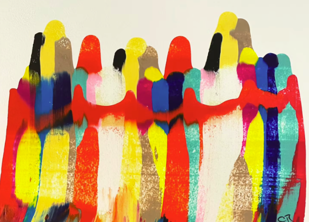
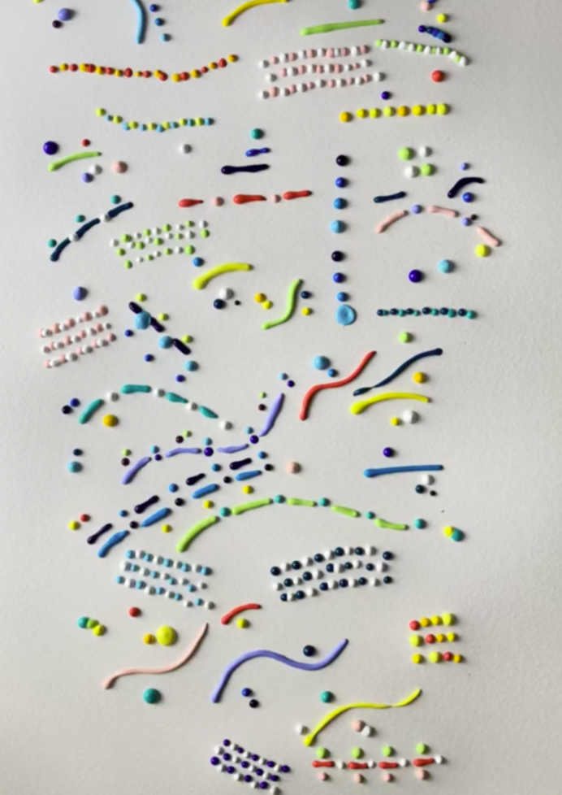
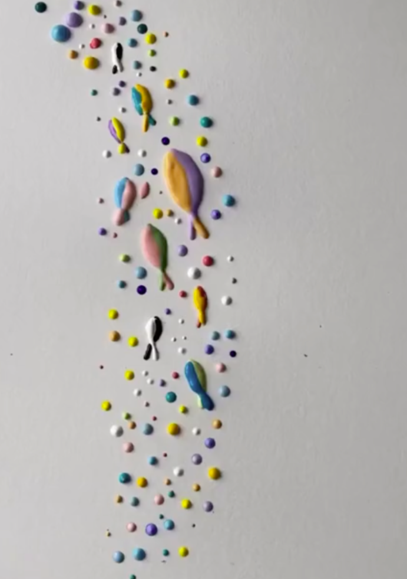
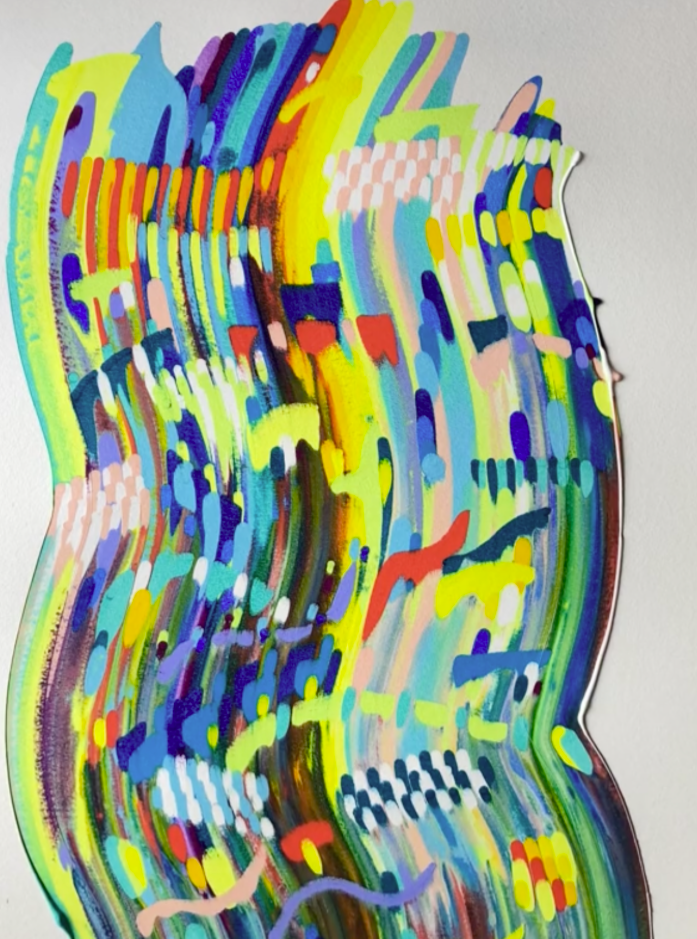
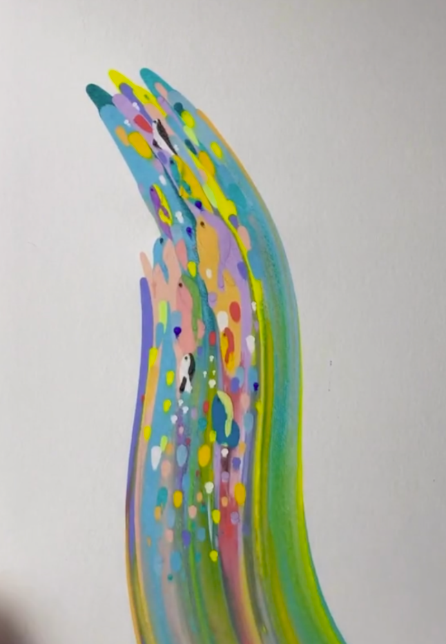

# Squeegee Away!

## Materials needed:
- Squeegee
- Acrylic paints
- Sheets of paper

## Steps to create your own abstract art

(Put on some gloves it'll get messy! And try to clean up as you go before the paint dries up.)

### Step 1: Patterns using squiggles and dots
- Begin by taping your paper to the desk. You can use different colors of paint to create random or thought-out patterns on your sheet of paper. 
- Shake the bottle of paint prior to applying it on your paper, it helps it flow more evenly on to your sheet.
- Try not to overlap colors as they will combine and turn to a different color. The volume of paint you pour will affect how much it spreads as you squeegee down. 
- FYI: A large amount of paint may cause your paper to warp as it absorbs the moisture from the paint. Start with small amounts of paint to see how it turns out!

#### Random Patterns

#### Pre-planned Design

### Step 2: Squeegee from the top
You can drag the squeegee in any direction starting from the top depending on your preferences. A few examples of different styles employed:

#### Zig-zag motion

#### Minimal downward motion

A great aspect of this art style is you can experiment with a ton of different techniques and achieve something unique each time!

### Other examples for some inspiration and resources:
- [Multiple layers, TikTok Video by @art_official169](https://www.tiktok.com/@art_official169/video/7213219183994178843)
- [Adding line drawings to your painting](https://www.hellowonderful.co/post/squeegee-paint-drawing/)
- [Tips from an expert and her fun paintings](https://www.businessinsider.com/artist-creates-colorful-paintings-using-a-squeegee-2022-8)
